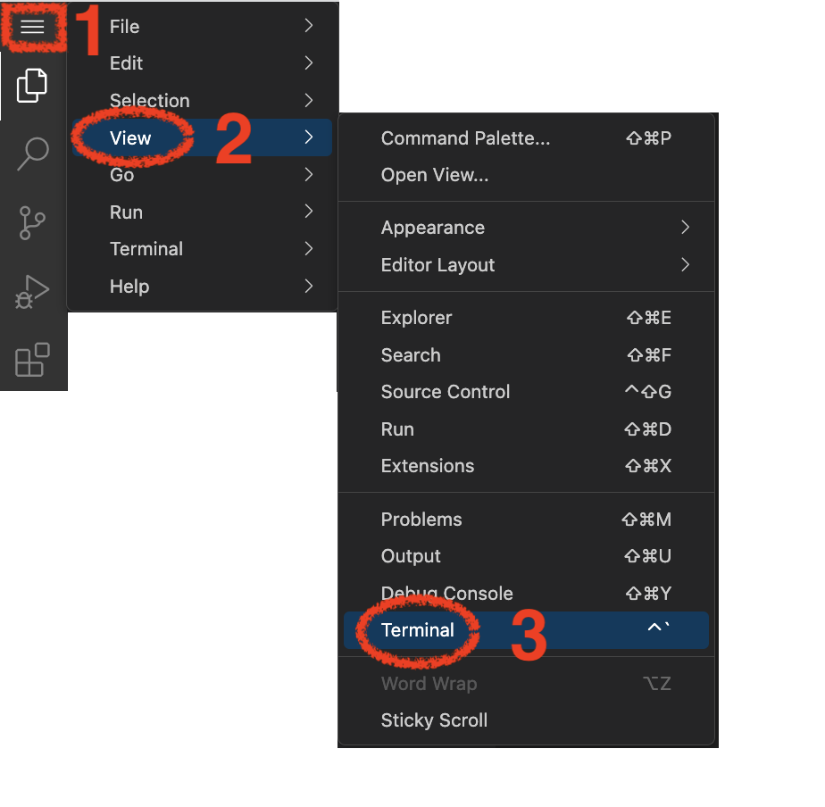
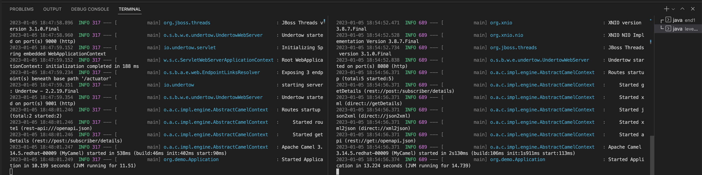
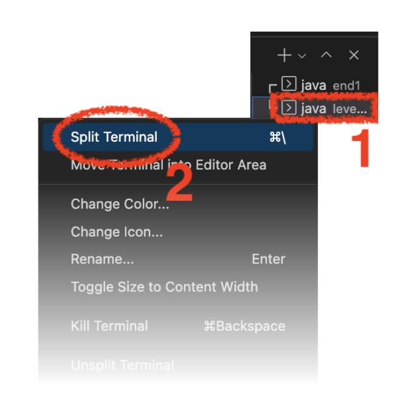
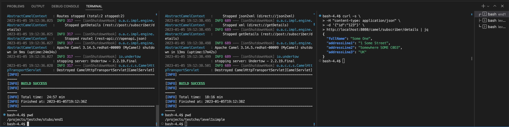
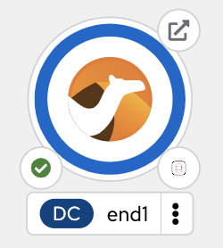

:walkthrough: Lab Introduction
:user-password: openshift
:namespace: {user-username}

:experimental:

// URLs
:codeready-url: http://codeready-che.{openshift-app-host}/

ifdef::env-github[]
endif::[]

[id='lab-intro']
= Camel Spring Boot - Simple Demo

Explore, build, test and deploy a Camel Spring Boot demo application using the Developer Sandbox and OpenShift Dev Spaces.

This hands-on lab is based on the following blog article in Red Hat Developers:

Assuming you have followed the article's instructions, you should be all ready to get hands-on with Camel Spring Boot in the OpenShift Dev Spaces workspace.

{empty} +

[time=2]
[id="explore-code"]
== Explore the source code

For illustration purposes the picture below shows what the integration end to end flow looks like.

image::images/00-demo-end2end.png[align="center", width=90%]

The Camel route definition would define the entire end to end processing logic, which you can find in your project explorer here:

[time=3]
[id="terminal-stub"]
== Run the stub in your terminal

The stub acts as the backend service that provides the XML data we need to fetch.

{empty} +

. Open your terminal
+
Make sure you make visible your terminal in the IDE. You can toggle it using the keyboard keys kbd:[Ctrl + `] or simply find the option from the menu system as per the picture below:
+

. Let's first run the stub
+
Copy and paste the following command in your terminal to place yourself in the stub's Camel Spring Boot project:
+
[source, subs=]
----
cd stubs/end1 
----
+
{blank}
+
Then, copy/paste the following command to start the stub in the terminal:
+
[source, subs=]
----
mvn -Dspring-boot.run.profiles=dev -s configuration/settings.xml 
----
+
{blank}
+
--
* After _Maven_ downloads all the dependencies, you should see in your terminal logs the stub has started:
+
image::images/02-stub-terminal-logs.png[align="left", width=100%]
+
NOTE: Two notifications pop up informing about new listening ports. You can ignore the messages, they will automatically close after a few seconds.
--
+
{empty} +
+
Now, test your stub from a new terminal. From your terminal's top right corner, choose the Split option, as shown below:
+
image::images/03-terminal-split.png[align="left", width=40%]
+
{blank}
+
Copy/paste the following cURL command to obtain a response from the stub:
+
[source, subs=]
----
curl -s \
-H "content-type: application/xml" \
-d '' \
http://localhost:9000/camel/subscriber/details \
| bat -pP -lxml 
----
+
NOTE: The command also includes a pipe to colorise the XML output for better reading.
+
{blank}
+
The invocation should return an XML payload similar to:
+
----
<Individual>
    <Name>Some</Name>
    <Surname>One</Surname>
    <Address>
        <Number>1</Number>
        <Street>Some Street</Street>
        <City>Somewhere</City>
        <PostCode>SOME C0D3</PostCode>
        <Country>UK</Country>
    </Address>
</Individual>
----

{empty} +

[type=verification]
Did you obtain the same XML message as above shown?

[type=verificationSuccess]
You've successfully tested the stub !!

[type=verificationFail]
Inspect in stub logs to investigate possible failure causes.

[time=2]
[id="terminal-service"]
== Run the service in your terminal

The main _Camel_ service exposes a JSON REST API and integrates with the XML backend service (the stub).

{empty} +

. Run the main service
+
Copy and paste the following command in your terminal to place yourself in the main Camel Spring Boot project:
+
[source, subs=]
----
cd /projects/testche/level1simple/ 
----
+
{blank}
+
Then, copy/paste the following command to start the stub in the terminal:
+
[source, subs=]
----
mvn -Dspring-boot.run.profiles=dev -s configuration/settings.xml 
----
+
{blank}
+
--
* Some more dependencies will be downloaded before the engine starts. When done, you should see logs of both systems in both terminals:
+

+
NOTE: More notifications pop up about new listening ports. You can ignore the messages, they will automatically close after a few seconds.
--

+
{blank}
+
Open a third terminal from where you can issue commands, from your terminal's top right corner, choose the Split option, as shown below:
+

+
{blank}
+
Copy/paste the following cURL command to obtain a response from the stub:
+
[source, subs=]
----
curl -s \
-H "content-type: application/json" \
-d '{"id":"123"}' \
http://localhost:8080/camel/subscriber/details | jq 
----
+
NOTE: The command includes a pipe to parse the JSON response with JQuery, which nicely renders the returned JSON payload.
+
{blank}
+
The cURL command should return a JSON payload similar to:
+
----
{
  "fullName": "Some One",
  "addressLine1": "1 Some Street",
  "addressLine2": "Somewhere SOME C0D3",
  "addressLine3": "UK"
}
----

{empty} +

[type=verification]
Did you obtain the same JSON response as the one shown above?

[type=verificationSuccess]
You've successfully tested the main service !!

[type=verificationFail]
Inspect in stub logs to investigate possible failure causes.

[time=3]
[id="deploy-stub"]
== Deploy and test the stub

The stub acts as the backend service that provides the XML data we need to fetch.

{empty} +

. Stop both systems
+
Make sure you stop both the stub and the main service by selecting each terminal and pressing the keys keys kbd:[Ctrl + c]. Your view of your terminals should look like:
+

+
{empty} +
+
. Deploy the stub
+
Make sure your CLI `oc` client (OpenShift client) points to your Developer Sandbox namespace:
+
[source, subs=]
----
oc projects -q | xargs oc project 
----
+
NOTE: The Developer Sandbox only ollows 1 namespace per user.
+
The command above should output something similar to:
+
----
Now using project "bmesegue-dev" on server "https://172.30.0.1:443".
----
+
{empty} +
+
You can now copy and paste the following command in your terminal to trigger the deployment:
+
[source, subs=]
----
mvn oc:deploy -Popenshift -s configuration/settings.xml 
----
+
{blank}
+
--
* You'll see Maven fetching more dependencies and then interact with OpenShift to finalise the deployment of the stub.
+
When done, if successful, going back to your browser's tab with your _OpenShift's_ developer topology view, you should see the new service up and ready when fully started, looking similar to:
+

--
+
{empty} +
+
. Test the stub
+
Copy/paste the following cURL command to obtain a response from the stub:
+
[source, subs=]
----
curl -s \
-H "content-type: application/xml" \
-d '' \
http://end1:8080/camel/subscriber/details \
| bat -pP -lxml 
----
+
NOTE: The cURL command above now points to the newly deployed pod, with its service `end1` listening on port 8080.
+
NOTE: The command also includes a pipe to colorise the XML output for better reading.
+
{blank}
+
The invocation should return an XML payload similar to:
+
----
<Individual>
    <Name>Some</Name>
    <Surname>One</Surname>
    <Address>
        <Number>1</Number>
        <Street>Some Street</Street>
        <City>Somewhere</City>
        <PostCode>SOME C0D3</PostCode>
        <Country>UK</Country>
    </Address>
</Individual>
----

{empty} +

[type=verification]
Did you obtain the same XML message as above shown?

[type=verificationSuccess]
You've successfully tested the stub deployed in the sandbox !!

[type=verificationFail]
Inspect in stub logs to investigate possible failure causes.

[time=2]
[id="deploy-service"]
== Deploy and test the main service

With the stub already deployed, we just need to deploy the service which will integrate with the stub running under the same namespace.

{empty} +

. Deploy the service
+
Ensure you run the commands below from the terminal located in the path of your main service project.
+
You can now copy and paste the following command in your terminal to trigger the deployment:
+
[source, subs=]
----
mvn oc:deploy -Popenshift -s configuration/settings.xml 
----
+
{blank}
+
--
* Maven will interact with OpenShift to deploy the service.
+
When done, if successful, going back to your browser's tab with your _OpenShift's_ developer topology view, you should see both services available, the main service and the stub, up and ready when fully started, looking similar to:
+
image::images/08-topology-service-stub.png[align="left", width=50%]
--
+
{empty} +
+
. Test the service
+
Copy/paste the following cURL command to obtain a response from the stub:
+
[source, subs=]
----
curl -s \
-H "content-type: application/json" \
-d '{"id":"123"}' \
http://simple:8080/camel/subscriber/details | jq 
----
+
NOTE: The cURL command above now points to the newly deployed pod, with its service `simple` listening on port 8080.
+
NOTE: The command also includes a pipe to parse and colorise the JSON output for better reading.
+
{blank}
+
The invocation should return an XML payload similar to:
+
----
{
  "fullName": "Some One",
  "addressLine1": "1 Some Street",
  "addressLine2": "Somewhere SOME C0D3",
  "addressLine3": "UK"
}
----
+
{empty} +
+
. Invoke an external service call
+
Notice the previous cURL command uses an internal service URL, which is not directly accessible by external consumers. However, the deployment process automatically creates a route in OpenShift that exposes the service to external consumers.
+
You can obtain the route details with the following command and use its URL from your favorite local HTTP client/tester, like podman or others.
+
[source, subs=]
----
oc get route simple 
----
+
Copy/paste the following cURL command to obtain a response from the stub:
+
[source, subs=]
----
curl -s \
-H "content-type: application/json" \
-d '{"id":"123"}' \
http://simple:8080/camel/subscriber/details | jq 
----
+
NOTE: The cURL command above now points to the newly deployed pod, with its service `simple` listening on port 8080.
+
NOTE: The command also includes a pipe to parse and colorise the JSON output for better reading.
+
{blank}
+
The invocation should return an XML payload similar to:
+
----
{
  "fullName": "Some One",
  "addressLine1": "1 Some Street",
  "addressLine2": "Somewhere SOME C0D3",
  "addressLine3": "UK"
}
----

{empty} +

[type=verification]
Did you obtain the same JSON response as above shown?

[type=verificationSuccess]
You've successfully tested the simple service deployed in the sandbox !!

[type=verificationFail]
Inspect in stub logs to investigate possible failure causes.

